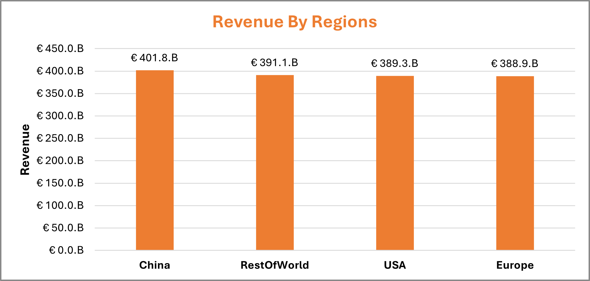
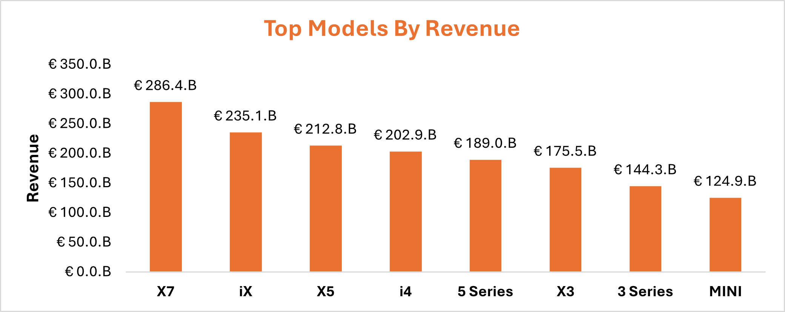
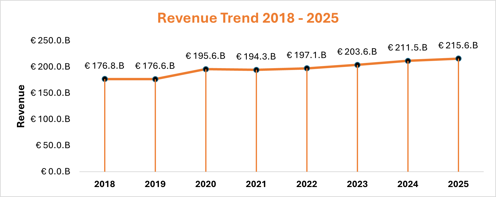
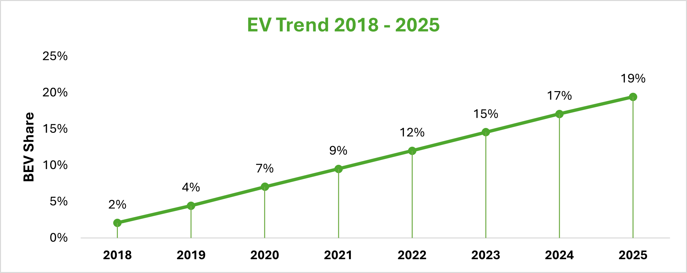
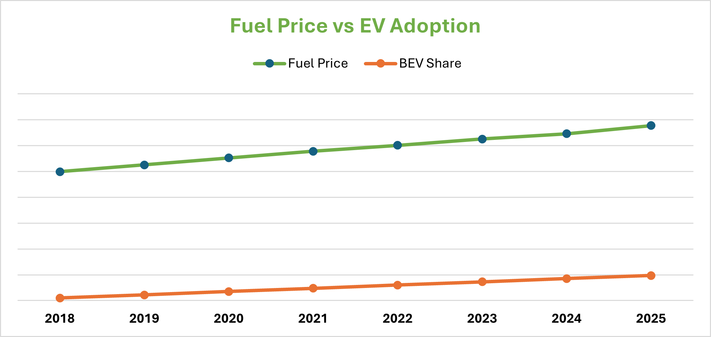
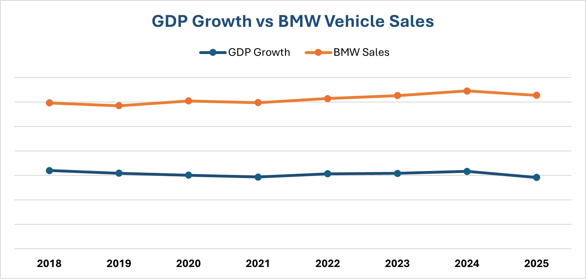
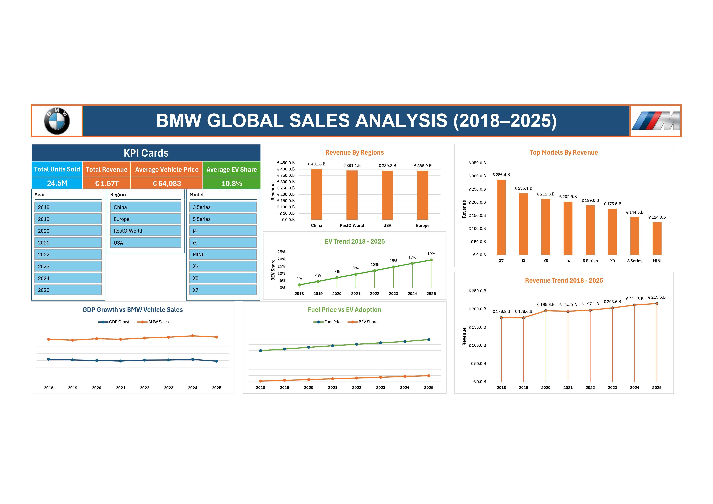

# BMW Global Sales Analysis (2018–2025)

---

# Project Overview

This project analyzes **BMW's global vehicle sales performance from 2018 to 2025**.

The objective is to identify the **key drivers of sales and revenue growth**, analyze the **impact of electric vehicle (EV) adoption**, and evaluate the influence of **macroeconomic factors** such as GDP growth and fuel prices.

The analysis was conducted using **Microsoft Excel**, leveraging:

- Power Query
- Pivot Tables
- Pivot Charts
- Interactive Dashboard

---

# Business Question

**What factors drive BMW's global sales and revenue performance across regions from 2018 to 2025?**

## Sub-questions

- Which regions generate the most revenue?
- Which BMW models contribute most to revenue?
- How has EV adoption evolved over time?
- Do fuel prices influence EV adoption?
- Does GDP growth influence BMW sales?

---

# Dataset

The dataset was obtained from **Kaggle**:

**BMW Global Automotive Sales Dataset**

The dataset contains **monthly BMW vehicle sales data** with additional **macroeconomic indicators**.

---

# Dataset Structure

The dataset contains:

- **3,073 rows**
- **11 columns**

| Column | Description |
|------|-------------|
| Year | Calendar year (2018–2025) |
| Month | Month of sale |
| Region | Market region (Europe, China, USA, Rest of World) |
| Model | BMW vehicle model |
| Units_Sold | Number of vehicles sold |
| Avg_Price_EUR | Average vehicle transaction price |
| Revenue_EUR | Total revenue |
| BEV_Share | Share of electric vehicles |
| Premium_Share | BMW premium market share |
| GDP_Growth | Regional GDP growth (%) |
| Fuel_Price_Index | Relative fuel price index |

**GDP (Gross Domestic Product)** represents the total value of goods and services produced in an economy during a given period.

---

# Data Preparation

The dataset was imported into **Microsoft Excel using Power Query**.

### Steps Performed

1. Imported the CSV dataset using **Power Query**
2. Promoted the first row to column headers
3. Adjusted column data types

| Column | Data Type |
|------|-----------|
| Year | Whole Number |
| Month | Whole Number |
| Units_Sold | Whole Number |
| Avg_Price_EUR | Whole Number |
| Revenue_EUR | Whole Number |
| BEV_Share | Decimal Number |
| Premium_Share | Decimal Number |
| GDP_Growth | Decimal Number |
| Fuel_Price_Index | Decimal Number |

---

# Data Cleaning & Validation

Several validation checks were performed to ensure **data accuracy and reliability**.

### Missing Values

All columns were checked for missing values.

**Result:**  
No missing values were detected.

---

### Duplicate Records

The dataset was checked for duplicate rows based on the following key fields: Year + Month + Region + Model

These fields uniquely identify each observation.

**Result:**  
No duplicate rows were found.

---

### Revenue Validation

Revenue values were validated using the following formula: Revenue_EUR = Units_Sold × Avg_Price_EUR

The dataset showed **consistent revenue calculations**, confirming the reliability of the data.

---

### Invalid EV Share Values

During validation, **9 rows contained negative BEV share values**.

Since EV market share cannot be negative, these rows were removed.

These rows represented only **0.29% of the dataset**, indicating **negligible impact on the analysis**.

---

# Exploratory Data Analysis (EDA)

Several **pivot tables and pivot charts** were created to explore trends and patterns in the data.

---

## 1. Regional Sales Performance

China generated the **highest BMW revenue** among all regions.

This indicates that **China is BMW's largest and most valuable market**.

---

## 2. Model Revenue Performance

Top revenue-generating models:

1. **BMW X7**
2. **BMW iX**
3. **BMW X5**

Premium SUV models contribute significantly to BMW’s overall revenue.

---

## 3. Revenue Trend

Revenue increased **steadily from 2019 to 2025**, indicating strong business growth.

---

## 4. EV Adoption Trend

EV share increased significantly over the analysis period. This reflects the **rapid transition toward electric vehicles** in the automotive industry.

---

## 5. Fuel Price vs EV Adoption

Fuel price increases correlate with **higher EV adoption**.

Higher fuel prices may encourage consumers to **switch to electric vehicles**.

---

## 6. GDP Growth vs Sales

GDP growth showed **weak correlation with BMW sales**.

This suggests that other factors may play a more important role in driving sales growth, including:

- Product strategy
- Regional demand
- EV expansion

---

# Interactive Dashboard

The dashboard summarizes key insights about BMW’s global sales performance and allows users to interactively explore data using slicers.

Dashboard features include:

- KPI cards
- Interactive slicers (Year, Region, Model)
- Regional revenue analysis
- Model revenue ranking
- EV adoption trends
- Macroeconomic factor analysis

---

# Dashboard KPIs

The interactive dashboard highlights the following key metrics:

| KPI | Value |
|----|------|
| Total Units Sold | **24.5M** |
| Total Revenue | **€1.57T** |
| Average Vehicle Price | **€64,083** |
| Average EV Share | **10.8%** |

---

# Key Insights

1. **China is BMW's largest revenue market.**
2. **Premium SUV models drive the majority of BMW revenue.**
3. Revenue has grown steadily **since 2019**.
4. **EV adoption increased dramatically** from **2% to 19%**.
5. **Fuel prices appear to influence EV adoption.**
6. **GDP growth has limited impact on BMW sales performance.**

---

# Business Recommendations

Based on the analysis, several strategic insights emerge:

### Expand Presence in China
China represents BMW's **largest revenue market**, suggesting continued investment and market expansion opportunities.

### Focus on Premium SUV Segment
High-end SUV models such as **X7, iX, and X5** drive a large share of revenue.

### Accelerate EV Strategy
EV adoption is increasing rapidly, indicating strong future demand for electric vehicles.

### Monitor Fuel Price Trends
Fuel price fluctuations may influence EV adoption and consumer purchasing behavior.

---

# Tools Used

- Microsoft Excel
- Power Query
- Pivot Tables
- Pivot Charts
- Interactive Dashboard

---

# Project Structure

BMW_Global_Sales_Analysis
│
├── Data
│ └── bmw_global_sales_2018_2025.csv
│
├── Images
│ ├── Regional_Revenue.png
│ ├── Model_Revenue.png
│ ├── Revenue_Trend.png
│ ├── EV_Trend.png
│ ├── Fuel_vs_EV.png
│ ├── GDP_Growth_vs_Sales.png
│ └── Dashboard.png
│
├── BMW_Global_Sales_Analysis.xlsx
│
├── BMW_Global_Sales_Analysis_Report.pdf
│
└── README.md

---

**Author:** Elnur Huseynov  
**Date:** 13.03.2026 – 16.03.2026  

🔗 LinkedIn: https://www.linkedin.com/in/elnurhuseynv/

